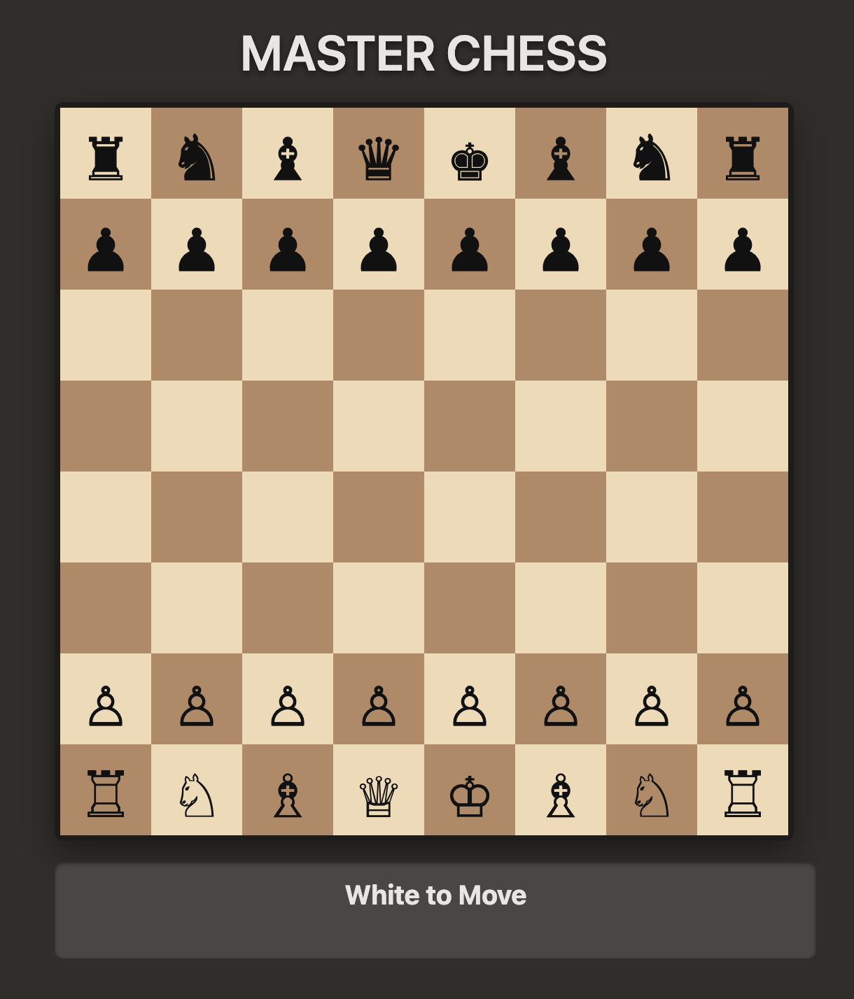

# ♟️ Chess Game by Aashish

A fully functional chess game built using **HTML, CSS, and JavaScript**. This project was created from scratch without using any external libraries or chess engines. All logic, movement, and rules are implemented manually, including **legal moves**, **check**, **checkmate**, and **stalemate detection**.

> 🎯 This is a passion project focused on learning algorithmic thinking and advanced DOM manipulation.

---

## 🎮 Live Demo

🔗 [Play the Game Here](https://chess-game-indol-nine.vercel.app/)  

---

## 🧠 Features

- ✅ **Complete 8x8 Chessboard**
- ✅ **All chess pieces and their standard movements**
- ✅ **Check and checkmate detection**
- ✅ **Stalemate recognition**
- ✅ **Pawn promotion to Queen**
- ✅ **Castling (both kingside and queenside)**
- ✅ **Turn-based gameplay with visual turn indicator**
- ✅ **King-in-check visual highlight**
- ✅ **Selectable piece with move highlighting**
- ✅ **Visual feedback for valid moves and captures**

---

## 🚫 Not Included

- ❌ En passant capture
- ❌ Move history / undo
- ❌ AI opponent (Only 2-player local play)
- ❌ Drag-and-drop movement (uses click-to-move instead)

---

## 🧩 Tech Stack

| Layer     | Tech Used         |
|-----------|-------------------|
| Structure | HTML5             |
| Style     | CSS3              |
| Logic     | JavaScript        |

---

## 📁 How to Run Locally

1. Clone the repository:
   ```bash
   git clone https://github.com/ashishxdev/chess-game

2. Open `index.html` in your browser.

### 📸 Screenshot


### 📌 Credits
Built with 💙 by **Aashish** as a passion project to explore **game logic** and **DOM programming** in depth.

### ⭐ Like This Project?
If you found this project interesting or useful,
please consider starring this repository on GitHub!
It helps the project grow and keeps me motivated to improve it.